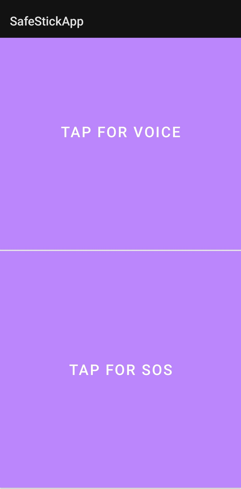

 ### SafeStick App
 ## Overview

SafeStick is an Android accessibility application built to assist blind and low-vision users through hands-free interaction, smart stick connectivity, and emergency assistance features.

The application focuses on simplicity and accessibility by minimizing complex interactions and enabling users to perform essential actions using voice commands. It integrates with a Bluetooth-enabled smart stick to deliver real-time obstacle alerts and provides quick access to navigation and emergency services.

## Key Features
## Voice-First User Experience

The entire application is designed around voice accessibility. Users can interact with the application using simple voice commands without relying heavily on touch-based navigation.

## Features include:

Voice commands to open navigation and start route guidance
Voice-based saving and management of emergency contacts
Voice interaction for accessing essential functionalities
Text-to-Speech feedback to confirm actions and provide information
## Smart Navigation Support

SafeStick makes navigation more accessible by allowing users to open Google Maps using voice commands.

Voice input for destination search
Seamless integration with Google Maps navigation
Reduced dependency on manual typing and screen interaction
## SOS Emergency Assistance

The SOS system is designed to provide immediate help during emergencies.

Save emergency contacts through voice commands
Initiate emergency calls instantly
Automatically send SOS messages after the call
Share the user's current location with the emergency contact
## Real-Time Obstacle Detection

The application communicates with the smart stick using Bluetooth technology.

When the ultrasonic sensor detects an obstacle:

The app receives obstacle information from the stick
Text-to-Speech announces the obstacle details and distance
Vibration alerts provide additional feedback in noisy environments
Alerts continue even when the application is running in the background

This multi-sensory feedback ensures users can receive safety information in different environments.

## Technology Stack
Mobile Development
Kotlin
Android Studio
XML Layouts
Android SDK
Accessibility & Communication
Android Speech Recognition
Text-to-Speech (TTS)
Bluetooth (HC-05 Module)
Location & Navigation
GPS and Location Services
Google Maps Intent Integration
Hardware Integration
Arduino UNO
Ultrasonic Sensor
Vibration Module
## Architecture Overview

SafeStick follows a modular Android architecture where each major functionality is separated into dedicated components.

Application Layer
User interface optimized for accessibility
Voice command processing
User interaction handling
Service Layer
Bluetooth communication with the smart stick
Text-to-Speech engine
Background obstacle monitoring
SOS and location handling
Hardware Layer
Arduino-based smart stick
Ultrasonic sensor for obstacle detection
Data transmission through HC-05 Bluetooth

## Future Enhancements

Future improvements planned for SafeStick include:

AI-based object recognition using camera vision
More intelligent obstacle classification
Cloud synchronization for emergency contacts and settings
Advanced voice assistant capabilities
Route optimization designed for accessibility

## Screenshot of the app

  
  

